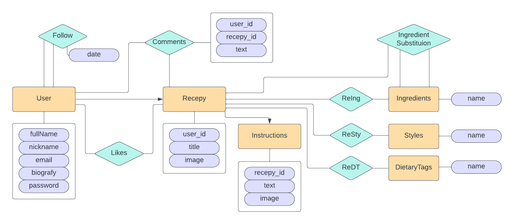

## Configuration

In this project, MySQL was selected as the database manager, feel free to use another RDB of your preference by changing the configuration in the corresponding places. 

Use an installed/remote MySQL DB, or install one locally (for this it will be used docker)
```shell
docker run -d --name mysql_docker -p 3306:3306 --env MYSQL_ROOT_PASSWORD=root --env MYSQL_ROOT_HOST=% mysql:latest
```
connect to it, then create the database:
```shell
mysql -h127.0.0.1 -uroot -proot

[]> create database hsdemo;
[]> exit;
```

Lastly, update the .env file in the root folder of the project with the connection configuration for the database. If it does not exist, copy *.env.example* to an *.env* file then change the respective variables in it.

```shell
cp .env.example .env
```

### Laravel Migartions

To run your first migrations, use the following command
```shell
php artisan migrate:fresh --seed
```

## RDB Design

For this project, it was used the following designt for the database structure:

<p align="center"></p>